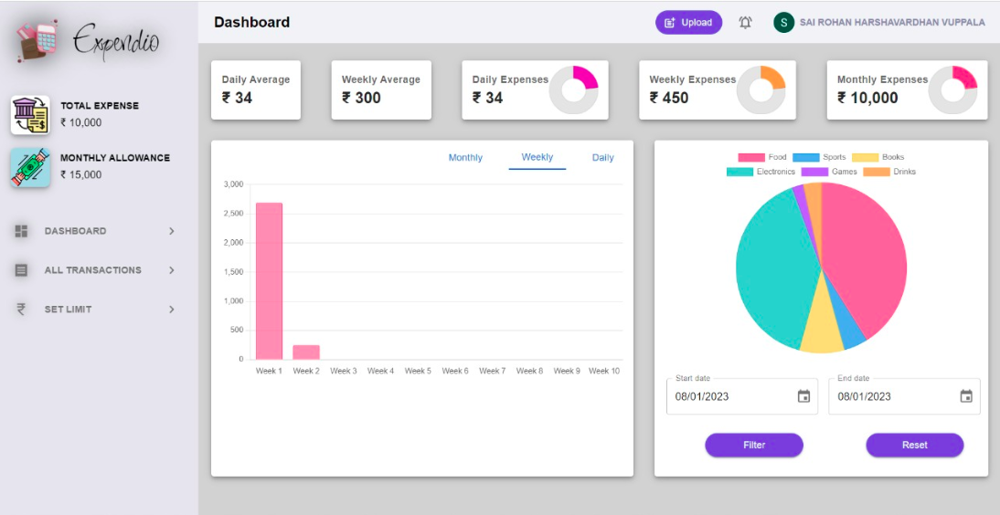

# Expendio - Expenditure Management App

The expenditure management app helps individuals track their monthly spending and set goals to better manage their finances. It provides a clear overview of where money is being spent and allows users to set limits on their spending in various categories, such as groceries, entertainment, and bills. Users can upload images of their invoices/bills, and the app automatically adds the information to their account in a secure way. The app supports user authentication through Google. The app also includes charts and graphs that visualize the user's spending habits over time, helping them to identify areas where they may be able to set targets for user-selected categories and track spending within the set timeline.

## Screenshots

### Dashboard

### Invoice Upload

### Edit uploaded invoice details

### View Targets

## List Invoices

